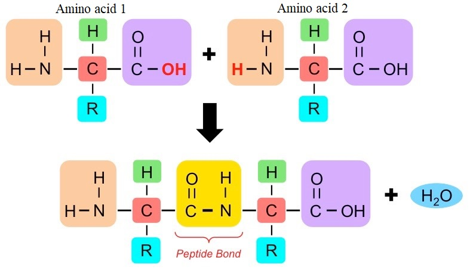
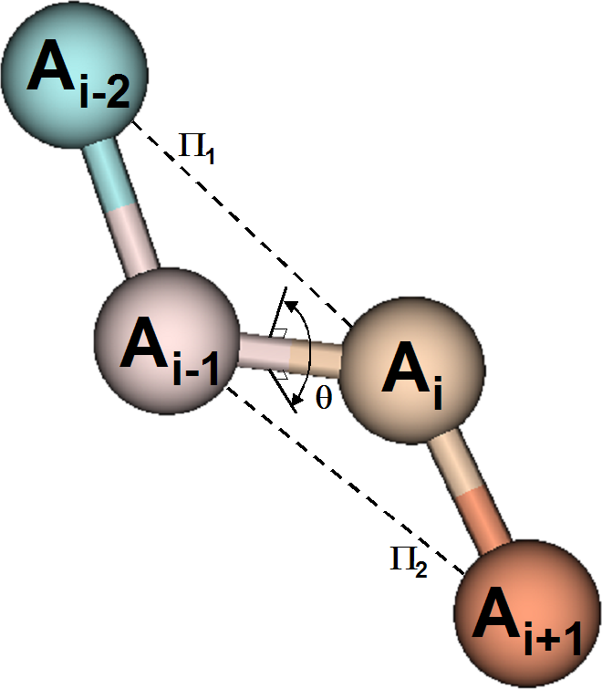
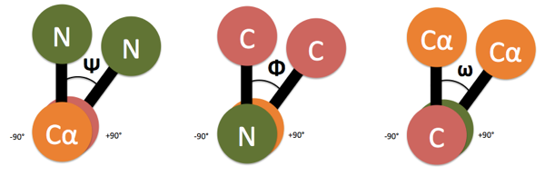

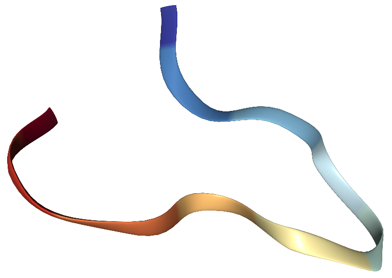

# Von Mises Graphical Models

Let  ${\Theta}= (\Theta_1, \Theta_2, \dots, \Theta_p)$ be a vector of random angles, it has a multivariate von Mises distribution; i.e. such that:

$f_{{\Theta}}(\Theta)= C^{-1}_p({\kappa},{\Lambda})\exp\{{\kappa}^Tc({\Theta},{\mu})+\frac{1}{2}s({\Theta},{\mu})^T{\Lambda}s({\Theta},{\mu})\}$

where $-\pi<\theta_j\leq\pi$  , $-\pi<\mu_j\leq\pi$ , $\kappa_j \geq 0$ ,  $-\infty<\lambda_{jl}<\infty$ , and  $C^{-1}_p({\kappa},{\Lambda})$ is a normalizing constant, 
$c({\Theta}, {\mu})^T=(\cos(\theta_1-\mu_1),\cos(\theta_2-\mu_2),\dots,\cos(\theta_p-\mu_p)),$ 

$s({\Theta},{\mu})^T=(\sin(\theta_1- \mu_1),\sin(\theta_2- \mu_2),\dots, \sin(\theta_p - \mu_p) ),$

${\mu}^T=(\mu_1, \mu_2, \dots, \mu_p)\\qquad\qquad{\kappa}^T=(\kappa_1,\kappa_2,\dots,\kappa_p),$

$\lambda_{jl}=\lambda_{lj}\,\qquad\qquad\lambda_{jj}=0$

It is possible to build a graphical model, $(G,Q)$, where $G=(V,E)$, and the set $V$ contains $p$ vertices, each of this is referred about each variables $\Theta=(\Theta_1,\Theta_2,\dots,\Theta_p)$, and the set $E$ is such that a missing edge indicates a conditional independence among variables.

The literature about this kind of graphical models is really poor and it focuses the attention on protein structure problem. Some examples are: <blockquote cite="https://www.pnas.org/content/105/26/8932?etoc-title=Boomsma">
Boomsma et al. (2008) 
 </blockquote> that use a dynamic Bayesian network, specifically, they adapt a generalization of hidden Markov model, to localize the protein structure in naive status; <blockquote cite="https://www.ncbi.nlm.nih.gov/pmc/articles/PMC2835366/">
Lennox et al. (2009) 
 </blockquote>   that present a Bayesian approach to density estimation for bivariate data which combines a Dirichlet process mixture model and a bivariate von Mises.

Most important work for our aim is one of<blockquote cite="http://ra.adm.cs.cmu.edu/anon/home/ftp/usr0/ftp/2011/CMU-CS-11-108.pdf">
Razavian et al. (2011).
 </blockquote>  They would predict the three dimensional structure of a protein given its amino acid sequence, and adopting an undirected graphical model.
They use a factor graph for study the independence structure, furthermore, they assume that angles of the amino acid sequence have a von Mises distribution.

The biggest problem of this approach is that the likelihood, and consequentially the log-likelihood, are not in closed form. To overcome this problem, they use a pseudo-likelihood to parameter estimate.

## Introduction to protein structure
In structural biology there is an unsolved problem called protein folding problem. In short, this problem is really important, in fact, since 1994, there is a biennial global competition called the Community Wide Experiment on the Critical Assessment of Techniques for Protein Structure Prediction (CASP). This competition has become the gold standard for assessing techniques, and the last year it has been won by a department of Google, Deep Mind, which has presented an Artificial Intelligence called  <blockquote cite="https://deepmind.com/blog/article/AlphaFold-Using-AI-for-scientific-discovery">
AlphaFold
 </blockquote>
This is to predict the three dimensional structure of a protein given its amino acid sequence.

Proteins are large and complex molecules, they are essential in sustaining life. In this paragraph, we give a brief outline of the fundamental aspects of their structure. For furthermore information can be found, for example in <blockquote cite="https://mospace.umsystem.edu/xmlui/bitstream/handle/10355/57017/research.pdf?sequence=2">
Brändén and Tooze (1999)
 </blockquote><blockquote cite="https://pdfs.semanticscholar.org/9243/d38211a9220a5802d44e437e8fa4619a95c3.pdf">
 Lesk (2001).
 </blockquote>

<figure>
 
 <figcaption>Peptide bond arising from the carboxyl group of the amino acid 1 condenses with anime group of amino acid 2. This drops a water molecule ($H_2O$) and form a peptide bond between the carbon atom of first amino acid and the nitrogen atom of the second amino acid. The process continues to produce a polypeptide</figcaption>
</figure>

Specific atomic groups, so-called \emph{amino acids}, give rise to a protein. There are twenty commonly occurring amino acid, each with the same structure. In particular, an amino acid has a central carbon acid, denoting by $C^\alpha$, which bind to a hydrogen atom, $H$, an amine group $NH_2$ , a carboxyl group ($COOH$) and a side chain. The last identify the amino acid kind, while the carboxyl group makes a link among different amino acids, and is called peptide bond. Figure above shows an example of this bond. One or more peptide bond form a polypeptide chains, and one or more of those form a protein.

The amino acid sequence is called primary structure, the peptide chains are named secondary structure, instead, polypeptide chains are defined as tertiary structures. 

#### The protein backbone
Definition of backbone:
</blockquote><blockquote cite="https://www.exzellent-forschen.de/chemie/oc3sewald/downloads/200910_ws/IUPACrecommendations.pdf">
 That linear chain to which all other chains, long or short or both, may be regarded as being pendant. Note: where two or more chains could equally be considered to be the main chain, that one is selected which leads to the simplest representation of the molecule.
 </blockquote>

 An example of protein backbone is:
 
$$ N_1 - C^\alpha_1 - C_1 - N_2 - C^\alpha_2 - C_2 - \cdots - N_p - C^\alpha_p -C_p$$

<figure>

</figure>

We consider a dihedral angle, which is the angle between planes through two sets of three atoms, having two atoms in common. 
<figure>
 <figcaption>Dihedral angles Phi, Psi, and Omega.</figcaption>
</figure>

Figure above shows a dihedral angle $\theta$ defined in terms of atoms $A_{i-2}, A_{i-1}, A_i , A_{i+1}$. It is important to know that the plane $\Pi_1$ passing through the atoms $A_i$ and $A_{i-2}$, as the plane $\Pi_2$ passing through the atoms $A_{i-1}$ and $A_{i+1}$. The angle $\theta$ is measured between $-\pi$ and $\pi$, the zero direction is observed when the plane $\Pi_1$ and $\Pi_2$ collapses. Clearly, if $A_{i}=N_i$, then $A_{i+1}=C_{i}$, $A_{i-1}=C^\alpha_i$ and $A_{i-2}=C_i$, while $\theta$ is $\phi_i$. This situation is clarifying in last figure.

 However, most combinations of $\phi$ and $\psi$ angles are impossible because they would result in steric collisions between backbone and side chain atoms. Hence, it is useful to look at the Ramachandran plot. 
 
 
 This graph plots $\psi$ versus $\phi$ angles for amino acid proteins, in this way the combination observables come out, and they can be classified as alpha helices and beta strands. The pairs ($\phi$, $\psi$)  commonly tends to make an asymmetric clusters: if $\psi$ angle is positive and $\phi$ is negative, then the pairs contributes to a beta stand shape, while if both of them are negative, they contributes to a right-handed alpha helices, and if both of them are positive, we can look a left-handed alpha helices.
 
 
 Figure below clarifies how to read a Ramachandran plot, and highlight each zone that corresponds to the different shape of the secondary structure.
 
<figure>
  
 <figcaption>Ramachandran plot, that draws a Psi angle versus Phi angle.</figcaption>
 </figure>

## Protein data

Protein structure can be surveyed  through an atomic level by X-ray diffraction and neutron-diffraction studies of crystallized proteins, and more recently through nuclear magnetic resonance (NMR) spectroscopy of proteins in solution. In this way, we observe the $N-C_\alpha$ and $C_\alpha - C$ bonds that are free rotation, and are represented by the torsion angle $\phi$ and $\psi$, respectively.

Fortunately, there is a Protein Structure Databank (PDB), that collects over ten thousand angle pairs, which provide ample data for even relatively studies.  For our purpose, we choose an existing protein codifying as 1yt6, which is unclassified protein. This protein is cited for the first time in </blockquote><blockquote cite="https://febs.onlinelibrary.wiley.com/doi/pdf/10.1111/j.1742-4658.2005.04902.x">
 Murata et al. (2005).
 </blockquote>

Nine amino acids compose 1yt6, and its structure is characterized by only a beta sheet.  

<figure>
  
 <figcaption>Three dimensional shape of 1yt6 protein.</figcaption>
</figure>

In the last figure we can see the three dimensional shape of protein, that is given by PDB file, this also contains a matrix data, with fifty rows, each corresponding to an observation, and nine columns, one for each amino acid of the sequence.

